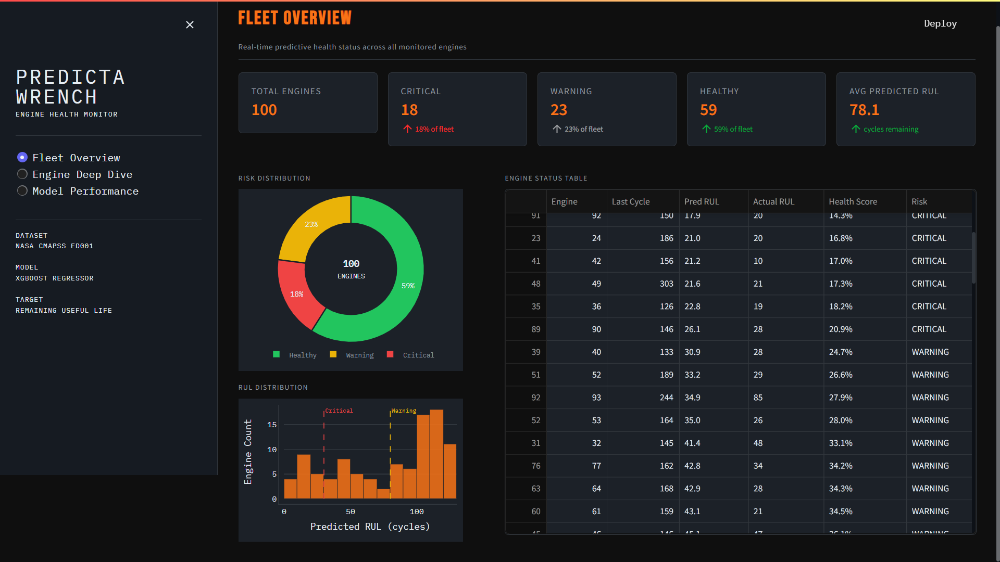
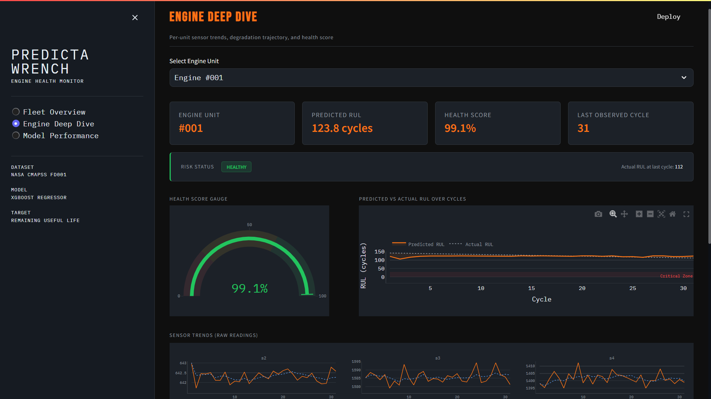
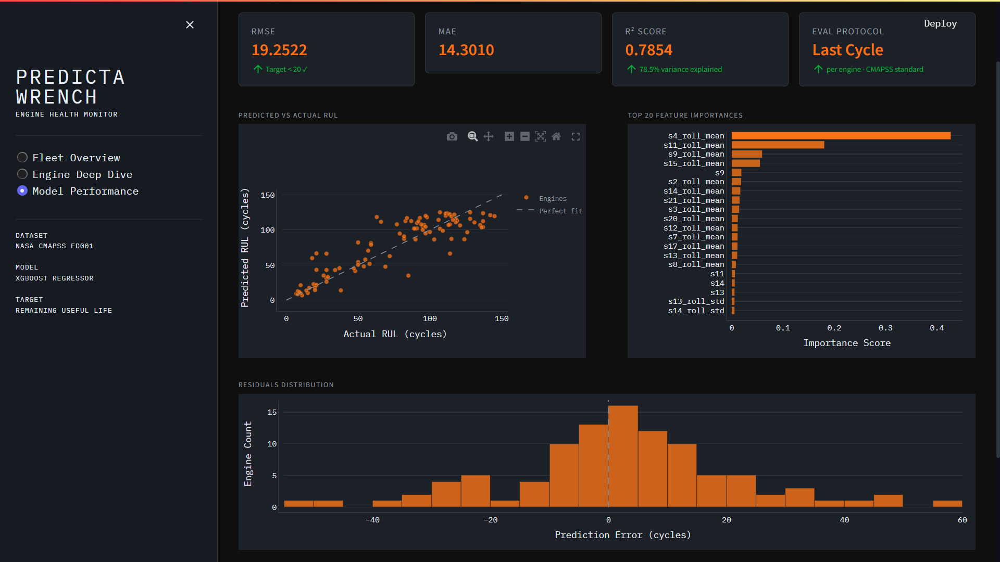

# ⚙️ PredictaWrench — Predictive Maintenance Engine Health Monitor

An end-to-end machine learning pipeline that predicts the **Remaining Useful Life (RUL)** of aircraft engines using NASA's CMAPSS sensor dataset, deployed as an industrial-grade Streamlit dashboard.

🚀 **[Live Demo → Click Here](https://predictawrench-tn019.streamlit.app)**

## Key Results

| Metric | Value |
|--------|-------|
| RMSE   | 19.25 cycles |
| MAE    | 14.30 cycles |
| R²     | 0.785 |
| Engines Monitored | 100 |
| Risk Classification | Critical / Warning / Healthy |

---

## Screenshots

> _Add screenshots here after running the dashboard_

| Fleet Overview | Engine Deep Dive | Model Performance |
|----------------|------------------|-------------------|
|  |  |  |

---

## Project Structure

```
predictawrench/
├── data/
│   ├── train_FD001.txt          # Raw CMAPSS train file (download separately)
│   ├── test_FD001.txt           # Raw CMAPSS test file
│   ├── RUL_FD001.txt            # Ground truth RUL values
│   ├── train_clean.csv          # Generated by data_loader.py
│   ├── test_clean.csv           # Generated by data_loader.py
│   ├── train_features.csv       # Generated by feature_engineering.py
│   └── test_features.csv        # Generated by feature_engineering.py
├── models/
│   ├── xgb_rul_model.pkl        # Trained XGBoost model
│   ├── scaler.pkl               # Fitted StandardScaler
│   ├── metrics.csv              # RMSE, MAE, R² scores
│   ├── feature_importance.png   # Top 20 feature importance chart
│   └── pred_vs_actual.png       # Predicted vs actual scatter plot
├── src/
│   ├── data_loader.py           # Phase 1 — data ingestion & RUL labeling
│   ├── feature_engineering.py   # Phase 2 — rolling features & preprocessing
│   └── model.py                 # Phase 3 — training, evaluation, artifacts
├── app/
│   └── streamlit_app.py         # Phase 4 — dashboard (or app.py at root)
├── requirements.txt
└── README.md
```

---

## Dataset Download

1. Go to [https://www.kaggle.com/datasets/behrad3d/nasa-cmaps](https://www.kaggle.com/datasets/behrad3d/nasa-cmaps)
2. Download and unzip the dataset
3. Copy these three files into the `data/` folder:
   - `train_FD001.txt`
   - `test_FD001.txt`
   - `RUL_FD001.txt`

---

## Setup & Installation

### 1. Clone the repository

```bash
git clone https://github.com/yourusername/predictawrench.git
cd predictawrench
```

### 2. Create and activate a virtual environment

```bash
# Using conda
conda create -n pw python=3.11
conda activate pw

# Or using venv
python -m venv venv
venv\Scripts\activate        # Windows
source venv/bin/activate     # macOS/Linux
```

### 3. Install dependencies

```bash
pip install -r requirements.txt
```

### 4. Download the dataset

Follow the [Dataset Download](#dataset-download) steps above and place the files in `data/`.

---

## Running the Pipeline

Run each script from the project root in order:

```bash
# Step 1 — Load and label raw data
python src/data_loader.py

# Step 2 — Feature engineering
python src/feature_engineering.py

# Step 3 — Train model and evaluate
python src/model.py

# Step 4 — Launch dashboard
streamlit run app/streamlit_app.py
```

The dashboard will open at `http://localhost:8501`.

---

## Pipeline Overview

### Phase 1 — Data Loading
- Parses CMAPSS FD001 train/test txt files into DataFrames with named columns
- Computes RUL labels for training set (max cycle − current cycle per engine)
- Assigns test RUL using ground truth from `RUL_FD001.txt`
- Saves cleaned CSVs to `data/`

### Phase 2 — Feature Engineering
- Drops 7 near-zero variance sensors: `s1, s5, s6, s10, s16, s18, s19`
- Computes rolling mean and std (window=5) for each remaining sensor
- Clips RUL at 125 cycles (piecewise linear degradation assumption)
- Outputs feature matrices saved to `data/`

### Phase 3 — Model Training
- Trains XGBoost regressor on engineered features with StandardScaler
- Evaluates on last observed cycle per engine (standard CMAPSS protocol)
- Saves model, scaler, metrics, and diagnostic plots to `models/`

### Phase 4 — Dashboard
- **Fleet Overview** — KPI cards, risk donut chart, RUL histogram, color-coded engine status table
- **Engine Deep Dive** — health gauge, predicted vs actual RUL curve, full sensor trend grid
- **Model Performance** — RMSE/MAE/R² cards, scatter plot, feature importance, residuals

---

## Tech Stack

| Component | Library |
|-----------|---------|
| Data processing | Pandas, NumPy |
| Feature engineering | Pandas rolling windows |
| Model | XGBoost |
| Evaluation | Scikit-Learn |
| Visualization | Plotly, Matplotlib, Seaborn |
| Dashboard | Streamlit |
| Model persistence | Joblib |

---

## Model Configuration

| Parameter | Value |
|-----------|-------|
| Algorithm | XGBoost Regressor |
| Estimators | 800 |
| Max depth | 6 |
| Learning rate | 0.05 |
| Subsample | 0.8 |
| RUL clip | 125 cycles |
| Rolling window | 5 cycles |
| Eval protocol | Last cycle per engine |

---

## Risk Classification

| Status | Condition | Action |
|--------|-----------|--------|
| 🔴 Critical | RUL < 30 cycles | Immediate inspection required |
| 🟡 Warning  | RUL 30–80 cycles | Schedule maintenance |
| 🟢 Healthy  | RUL > 80 cycles | Normal operation |

---

## License

MIT License — free to use for portfolio and educational purposes.